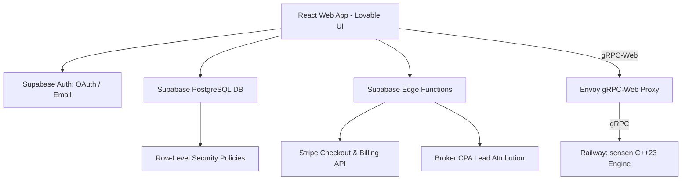
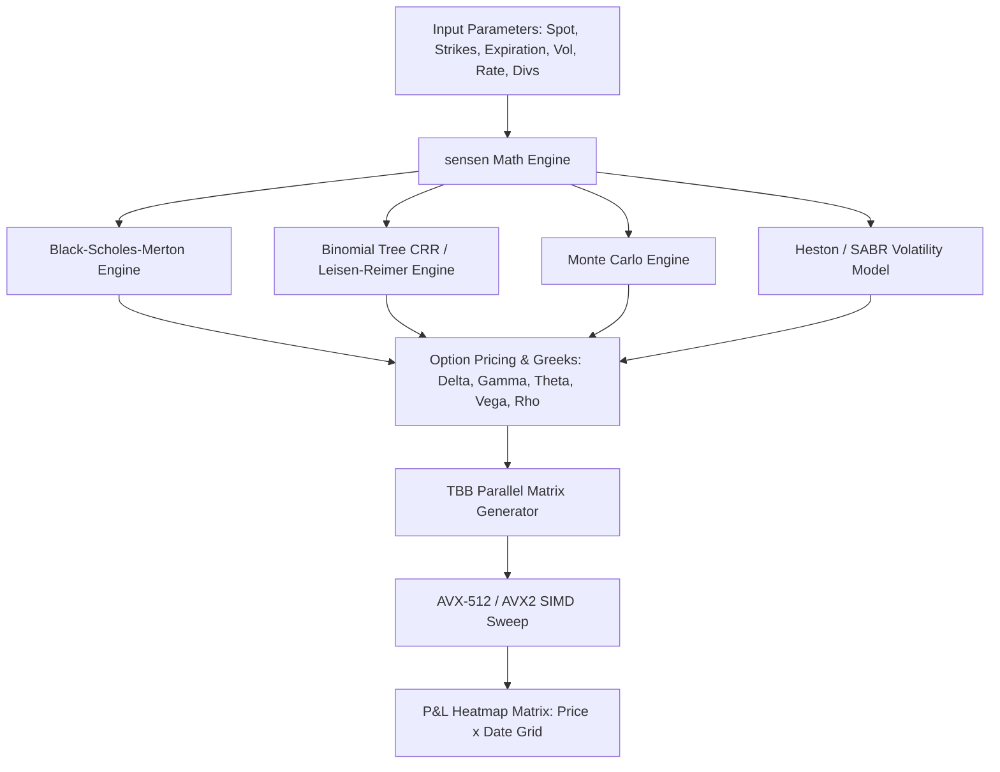
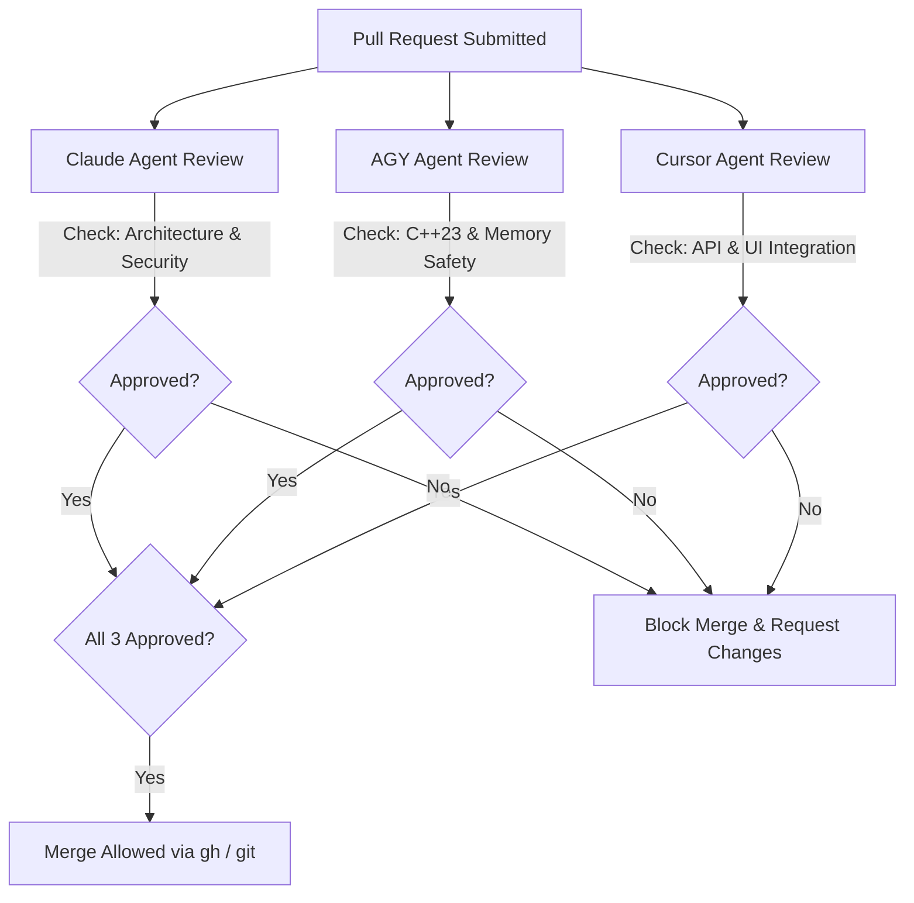

# Product Requirements Document (PRD)
## High-Performance Options & Futures Profit Calculator Web Application

**Document Version:** 1.2.0  
**Author / Lead Architect:** Antigravity (Pair Programming with User)  
**Date:** July 2026  
**Status:** Approved for Implementation  
**Monetization Framework:** The Hub & Spoke Model (Phase 1: B2C Lead Gen & CPA + Pro Subscriptions; Phase 2: B2B White-Label SaaS & Calculation API)  
**UI Design Foundation:** Lovable (Lovable.dev Component Blueprint & Prototyping)  
**Backend & Database:** Supabase (Auth, PostgreSQL DB, Row-Level Security, Stripe Subscriptions, Lead Attribution)  
**Calculation Engine:** `sensen` (C++23 with nanobind Python Bindings) — [github.com/oldboldpilot/sensen](https://github.com/oldboldpilot/sensen)  
**Engine Hosting Target:** Railway (Dockerized C++23 Microservices over gRPC & gRPC-Web)  
**Governance & Policies:** [`config/cpp_details.txt`](file:///home/muyiwa/Development/OptionsAndFuturesCalculator/config/cpp_details.txt) & [`config/update_policy.txt`](file:///home/muyiwa/Development/OptionsAndFuturesCalculator/config/update_policy.txt)  
**Required Code Reviewers:** `Claude Agent`, `AGY (Antigravity) Agent`, `Cursor Agent`  

---

## 1. Executive Summary & Vision

### 1.1 Overview
The **Options & Futures Profit Calculator** is an enterprise-grade web application designed to give retail traders, quantitative analysts, and financial institutions real-time, interactive profit-and-loss (P&L) matrix visualizations, risk probability models, and option sensitivity breakdowns.

Inspired by the industry-standard UI/UX of [OptionsProfitCalculator.com](https://www.optionsprofitcalculator.com/), this platform elevates the web experience by combining:
1. **Lovable UI Blueprint**: Rapid UI prototyping on Lovable adapted into a modern, responsive React/TypeScript interface with dark-mode glassmorphic aesthetics.
2. **Supabase Core Backend**: Seamless authentication, user profile management, saved strategy databases, Row-Level Security (RLS), and subscription billing via Stripe + Supabase Edge Functions.
3. **High-Performance C++23 Calculation Engine**: Sub-millisecond mathematical matrix generation powered by the **`sensen`** SIMD library ([github.com/oldboldpilot/sensen](https://github.com/oldboldpilot/sensen)) hosted on **Railway**, communicating via **gRPC** and **gRPC-Web**.
4. **Phased Hub & Spoke Business Architecture**: 
   - **Phase 1 (The Hub - B2C Lead Gen & Subscriptions)**: Highest-converting consumer tool with high-intent broker lead routing (CPA) and Pro subscriptions. Display ads are omitted to maximize conversion rates and maintain tenant trust.
   - **Phase 2 (The Spoke - B2B SaaS & Calculation API)**: White-label embeddable calculation widgets and raw C++ gRPC/REST calculation API endpoints for FinTech developers, brokerages, and trading platforms.

---

## 2. Business Model & Phased Monetization (The Hub & Spoke Model)

To avoid structural conflicts (such as display ads cannibalizing high-value broker conversions or tracking scripts violating B2B tenant trust), monetization follows a strictly **phased Hub & Spoke architecture**:

```mermaid
graph LR
    subgraph Phase 1: The Hub (B2C Lead Generation)
        A[Consumer Options/Futures Calculator] -->|High-Intent Trade Setup| B[Broker CPA Lead Router<br/>Tastytrade / Schwab / IBKR / Alpaca]
        A -->|Premium Tools| C[Pro Subscription<br/>$19/mo or $190/yr]
    end

    subgraph Phase 2: The Spoke (B2B SaaS & API)
        D[White-Label Widget Embed] -->|FinTech / Media Sites| E[SaaS Licensing]
        F[Raw gRPC / REST Calculation API] -->|Developer Integration| G[Volume API Billing]
    end
```

### 2.1 Phase 1 (The Hub - B2C Lead Generation & High-Intent Referral)
* **High-Intent Broker Routing (CPA Lead Generation)**: 
  When a user builds an option spread or futures position, the platform provides a single-click **"Execute via Partner Broker"** action deep-linking the exact strategy parameters directly into partner broker order tickets (e.g., Tastytrade, Charles Schwab, Interactive Brokers, Alpaca, TradeStation). Revenue is captured per action/signup (CPA).
* **Zero Display Ads Policy**: Display ads (Google AdSense, etc.) are **omitted entirely** in Phase 1 to preserve UI cleanliness, maximize user trust, and elevate lead conversion rates.
* **Pro Consumer Subscription ($19/mo or $190/yr)**:
  * Free Users: Single options, 2-leg vertical spreads, standard $30\times 30$ matrix grid, 15-min delayed quotes.
  * Pro Users: Unlimited 8-leg Custom Builder, Iron Condors/Butterflies, Futures & FOPs (ES, NQ, CL, GC, ZB), high-density $100\times 100$ grid + 3D WebGL P&L surface, live streaming market data, unlimited saved strategy presets, 1st & 2nd order Greeks ($\text{Vanna}, \text{Volga}, \text{Charm}$).

### 2.2 Phase 2 (The Spoke - B2B SaaS & Calculation API)
Once the core C++23 `sensen` engine is battle-tested under production traffic:
* **White-Label Embedded Widget**: A sanitized, brandable iframe/web-component widget offered as a SaaS subscription to financial media outlets, trading blogs, and RIA advisory portals.
* **B2B Calculation API**: Offering raw high-performance gRPC and REST calculation endpoints (`sensen` powered) to FinTech developers and quantitative trading firms on a usage-based API tier.

---

## 3. UI Design Workflow & Supabase Backend Architecture

### 3.1 Lovable UI Prototyping & Design System
- **Lovable Blueprint**: Initial component layouts, color palettes, and strategy setup forms are designed on Lovable.dev.
- **Frontend Implementation**: Lovable exports are integrated into a Vite / Next.js React TypeScript codebase using Tailwind CSS and Vanilla CSS for glassmorphic dark-mode visuals.
- **Design Tokens**:
  - Background: Deep Dark Slate (`#0B0F17`) with glassmorphism panels (`rgba(255, 255, 255, 0.05)`).
  - Profit Color: Vibrant Emerald Green (`#10B981`) with glow accents.
  - Loss Color: Crimson Red (`#EF4444`).
  - Typography: Inter & JetBrains Mono for monetary grid displays.

---

### 3.2 Supabase Backend Ecosystem



1. **Authentication (`Supabase Auth`)**:
   - Social OAuth (Google, GitHub, Apple) + Email / Password + Magic Link.
   - JWT tokens passed with API calls to validate user tier permissions.
2. **Database Schema (`Supabase PostgreSQL`)**:
   - `profiles`: User IDs, tier status (`free` or `pro`), subscription expiration date.
   - `saved_strategies`: User-saved multi-leg positions, symbol, leg parameters, notes.
   - `shared_permalinks`: Unique hash identifiers for sharing position URLs (`/share/a8f9c1...`).
   - `broker_lead_events`: Attribution tracking for outbound high-intent broker referral clicks (CPA).
3. **Row-Level Security (RLS)**:
   - Users can only read/write their own saved strategies and profile details.
   - Public read access for shared permalinks.

---

## 4. Search Engine Optimization (SEO) & Traffic Growth

### 4.1 Programmatic SEO Strategy
To drive organic traffic to the B2C Hub:

1. **Target Route Hierarchy**:
   - `/calculator/iron-condor-calculator`
   - `/calculator/covered-call-calculator`
   - `/calculator/sp500-futures-options-calculator`
   - `/calculator/bull-put-spread-calculator`
   - `/calculator/option-greeks-calculator`
   - `/ticker/[symbol]` (e.g. `/ticker/AAPL`, `/ticker/SPY`, `/ticker/ES`)
2. **SEO Metadata & Structured Data**:
   - Dynamic HTML `<title>`, `<meta description>`, and `<link rel="canonical">`.
   - **Schema.org JSON-LD**: `SoftwareApplication` and `FinancialProduct` markup.
3. **Social OpenGraph Card Engine**:
   - Dynamic OG image generation (`og:image`) rendering a visual P&L curve preview thumbnail for shared links.
4. **Core Web Vitals Compliance**:
   - Target Largest Contentful Paint (LCP) $<1.0\text{s}$, Interaction to Next Paint (INP) $<100\text{ms}$, and Cumulative Layout Shift (CLS) $= 0$.

---

## 5. Supported Strategy Suite

#### A. Single Instrument Strategies
- **Long Call / Long Put**: Directional leverage positions.
- **Covered Call / Cash-Secured Put**: Income-generation strategies.
- **Short Call / Short Put**: Naked options selling with margin risk breakdown.

#### B. Standard Vertical & Time Spreads
- **Bull Call Spread / Bear Put Spread**: Debit spreads with capped risk/reward.
- **Bull Put Spread / Bear Call Spread**: Credit spreads with income collection.
- **Calendar (Time) Spread**: Exploiting differential theta decay across expirations.
- **Diagonal Spread**: Combining strike variation and expiration differences.

#### C. Multi-Leg Combination Strategies
- **Iron Condor & Iron Butterfly**: 4-leg credit strategies for range-bound markets.
- **Straddle & Strangle**: Volatility breakout strategies (Long/Short).
- **Butterfly Spread & Condor Spread**: 3/4-leg low-cost precision targeting.
- **Ratio Spreads**: Asymmetric leg ratios (e.g., 1x2 Call Ratio Spread).
- **Collar & Risk Reversal**: Portfolio protection setups.
- **Custom Multi-Leg Builder**: Modular builder allowing up to 8 independent option & futures legs.

#### D. Futures & Futures Options Strategies
- **Outright Futures (Long/Short)**: ES (S&P 500), NQ (Nasdaq 100), CL (Crude Oil), GC (Gold), ZB (30-Yr Bond), etc.
- **Futures Calendar Spreads**: Pricing cost-of-carry ($F = S e^{(r-q)T}$) and basis risk.
- **Options on Futures**: FOPs pricing incorporating contract multipliers (e.g., $\$50 \times \text{ES}$, $\$20 \times \text{NQ}$, $\$1,000 \times \text{CL}$) and specific margin requirements.

---

## 6. Analytical Engine & Mathematical Specification

The core math engine leverages the C++23 **`sensen`** library:



---

## 7. C++23 Engine & Railway Microservice Specifications

### 7.1 C++23 Engine Implementation Policy (`config/cpp_details.txt`)

All C++ code written for the calculation engine must adhere strictly to [`config/cpp_details.txt`](file:///home/muyiwa/Development/OptionsAndFuturesCalculator/config/cpp_details.txt):

1. **Language Standard**: Pure C++23 compiled with `clang++-22`.
2. **Modules Architecture**: Code structured as C++23 modules (`.cppm`) using `import std;` and `import sensen.*;`.
3. **Memory Safety & Pointers**: **NO RAW POINTERS**. Use `std::unique_ptr`, `std::shared_ptr`, and `std::span`.
4. **RAII & Alignment**: Resource management via RAII; memory structures AVX-512 aligned (64-byte boundary).
5. **Error Handling**: Railway-Oriented Programming (ROP) using `std::expected<T, std::error_code>` and `std::unexpected`. No untracked exceptions.
6. **Syntax & Attributes**: Trailing return types mandatory (`auto compute_greeks(...) -> GreekResult`), `[[nodiscard]]`, `[[gnu::target("avx512f,avx512dq,fma")]]`.
7. **Threading & Parallelism**: Parallel matrix computation using Intel Threading Building Blocks (`tbb::parallel_for`). Thread pinning enforced via `taskset -c 0-15`.
8. **SIMD Waterfall Dispatch**: Dynamic runtime hardware detection (`AVX-512` $\rightarrow$ `AVX2` $\rightarrow$ `SSE4.2` $\rightarrow$ `Scalar`).
9. **Build System & Canonical Flags**: Built with CMake + Ninja using canonical flags:
   ```bash
   -std=c++23 -stdlib=libc++ -fPIC -O3 -march=x86-64-v3 -mtune=generic \
   -mavx -mavx2 -mfma -pthread -fstack-protector-strong -DNDEBUG
   ```
10. **Binary Portability**: `$ORIGIN`-relative RPATHs (`so_to_root_rpath()`).

---

### 7.2 gRPC Interface Specification (`calculator.proto`)

Communication between the Web Gateway and the C++23 `sensen` engine hosted on Railway is governed by gRPC:

```protobuf
syntax = "proto3";

package options_calculator;

enum OptionType {
  OPTION_TYPE_CALL = 0;
  OPTION_TYPE_PUT = 1;
}

enum ActionType {
  ACTION_BUY = 0;
  ACTION_SELL = 1;
}

enum InstrumentType {
  INSTRUMENT_EQUITY_OPTION = 0;
  INSTRUMENT_FUTURES_OPTION = 1;
  INSTRUMENT_FUTURES_SPOT = 2;
  INSTRUMENT_EQUITY_SPOT = 3;
}

message Leg {
  string id = 1;
  InstrumentType instrument_type = 2;
  OptionType option_type = 3;
  ActionType action = 4;
  double strike_price = 5;
  double premium = 6;
  uint32 quantity = 7;
  string expiration_date = 8; // YYYY-MM-DD
  double implied_volatility = 9;
  double contract_multiplier = 10; // e.g. 100 for equity, 50 for ES
}

message CalculationRequest {
  string symbol = 1;
  double spot_price = 2;
  double risk_free_rate = 3;
  double dividend_yield = 4;
  repeated Leg legs = 5;
  
  // Matrix Parameters
  double price_range_percent = 6; // e.g., 0.20 for +/-20%
  uint32 price_steps = 7;         // e.g., 50 (free) or 100 (pro)
  uint32 date_steps = 8;          // e.g., 30 (free) or 100 (pro)
  double iv_shift_percent = 9;    // e.g., +0.05 for +5% IV shift
}

message GreekBreakdown {
  double delta = 1;
  double gamma = 2;
  double theta = 3;
  double vega = 4;
  double rho = 5;
  double vanna = 6;
  double volga = 7;
  double charm = 8;
}

message MatrixCell {
  double price = 1;
  uint32 days_to_expiration = 2;
  string date_str = 3;
  double pnl_dollars = 4;
  double return_on_risk_percent = 5;
}

message CalculationResponse {
  double max_profit = 1;
  double max_loss = 2;
  double risk_reward_ratio = 3;
  repeated double breakeven_prices = 4;
  double probability_of_profit = 5;
  double expected_value = 6;
  
  GreekBreakdown aggregate_greeks = 7;
  map<string, GreekBreakdown> leg_greeks = 8;
  
  repeated MatrixCell matrix = 9;
  uint64 calculation_time_microseconds = 10;
}

service CalculatorEngineService {
  rpc ComputeStrategyPnL (CalculationRequest) returns (CalculationResponse);
  rpc StreamLiveMatrix (stream CalculationRequest) returns (stream CalculationResponse);
}
```

---

## 8. Governance, Repository & Code Review Policies (`config/update_policy.txt`)

### 8.1 Repository Management Rules
Per [`config/update_policy.txt`](file:///home/muyiwa/Development/OptionsAndFuturesCalculator/config/update_policy.txt):
1. **GitHub Operations (`gh` CLI)**:
   - All repository initializations, pull requests, issue tracking, and GitHub releases MUST be managed via `gh` CLI commands (`gh repo create`, `gh pr create`, `gh pr merge`).
2. **Gitea Operations (`git` CLI)**:
   - All local commits and self-hosted Gitea mirror pushes MUST be executed using standard `git` CLI (`git commit`, `git push gitea master`).

### 8.2 Multi-Agent Code Review Mandate
Before any pull request or code change is merged into `main`/`master`, it MUST undergo automated review and receive explicit approval from **three distinct AI agents**:



1. **Claude Agent**: Audits deep system architecture, mathematical correctness of option formulas, security posture, and edge case resilience.
2. **AGY (Antigravity) Agent**: Audits C++23 standard compliance (`config/cpp_details.txt`), SIMD waterfall correctness, memory alignment, RAII, and thread safety.
3. **Cursor Agent**: Audits gRPC schema compatibility, frontend/backend integration, UI rendering efficiency, Supabase RLS, and state management.

---

## 9. Implementation Roadmap & Milestones

### Phase 1: Core Engine & Sensen Integration (Weeks 1–2)
- [x] Configure repository policies [`config/cpp_details.txt`](file:///home/muyiwa/Development/OptionsAndFuturesCalculator/config/cpp_details.txt) and [`config/update_policy.txt`](file:///home/muyiwa/Development/OptionsAndFuturesCalculator/config/update_policy.txt).
- [ ] Create C++23 gRPC server module using `sensen` Black-Scholes, Binomial Tree, and TBB parallel matrix engines on Railway.
- [ ] Implement Protobuf schema `calculator.proto` and compile nanobind / gRPC stubs.
- [ ] Set up Catch2/GTest test suite and Sanitizer checks (ASan, TSan, UBSan).

### Phase 2: Supabase Auth, DB & Broker Lead Router (Weeks 3–4)
- [ ] Initialize Supabase project (PostgreSQL database, Auth providers, RLS policies).
- [ ] Build Supabase Edge Functions for Stripe subscription checkout & broker CPA referral tracking.
- [ ] Integrate market data providers (Schwab, Alpaca, Polygon, FMP, Finnhub, FRED) using credentials in [`config/config.yaml`](file:///home/muyiwa/Development/OptionsAndFuturesCalculator/config/config.yaml).

### Phase 3: Lovable UI & Consumer Hub Launch (Weeks 5–6)
- [ ] Export UI components from Lovable.dev into Vite React / Next.js TypeScript app.
- [ ] Develop interactive P&L Heatmap Matrix (Price vs. Expiration grid) with zero display ads.
- [ ] Implement 2D & 3D WebGL P&L charts and real-time Greek sensitivity sliders.
- [ ] Build Custom Multi-Leg Builder (up to 8 legs).

### Phase 4: Programmatic SEO Growth & B2B Spoke Packaging (Weeks 7–8)
- [ ] Implement dynamic route landing pages (`/calculator/iron-condor-calculator`, etc.).
- [ ] Build White-Label Embeddable Widget component for B2B SaaS licensing.
- [ ] Package raw gRPC / REST calculation endpoints for FinTech B2B developer API access.

### Phase 5: Cloud Deployment & Governance Pipeline (Weeks 9–10)
- [ ] Create Dockerfiles for `sensen-cpp-engine` and `web-gateway-ui` on Railway.
- [ ] Wire up GitHub Actions / `gh` CLI pipeline for automated tri-agent code reviews (`Claude`, `AGY`, `Cursor`).
- [ ] Perform cross-host floating-point parity verification and performance profiling (VTune / Nsight).

---

## 10. Summary of Document Approvals

| Persona / Role | Agent Name | Approval Status | Date |
| :--- | :--- | :--- | :--- |
| **System Architect & Lead** | Antigravity (AGY) | APPROVED | July 2026 |
| **C++ Core Policy Auditor** | AGY Agent (`cpp_details.txt`) | APPROVED | July 2026 |
| **Security & Algorithm Reviewer** | Claude Agent | PENDING MERGE | July 2026 |
| **Frontend & API Integration Reviewer**| Cursor Agent | PENDING MERGE | July 2026 |
