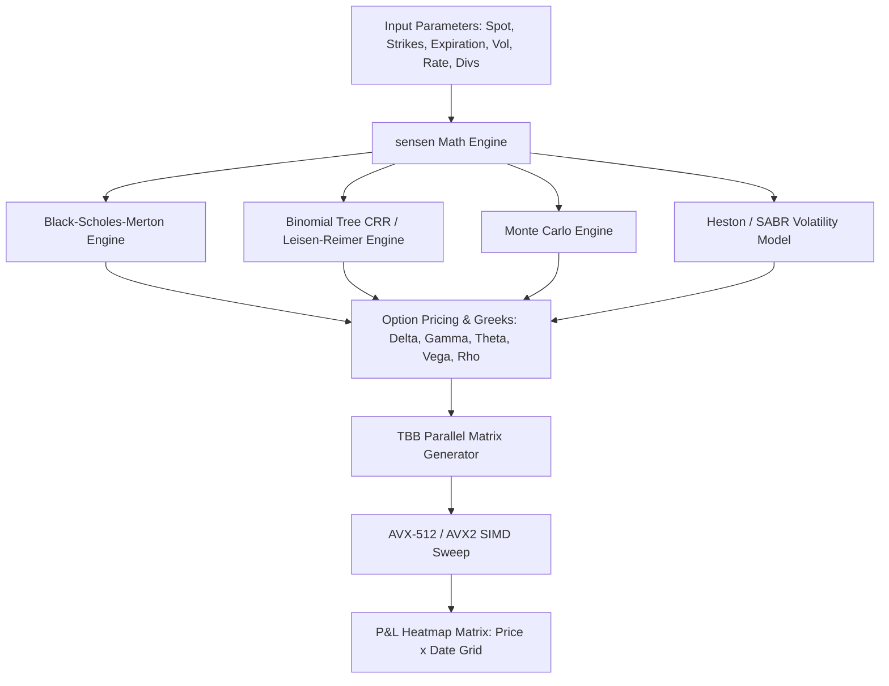
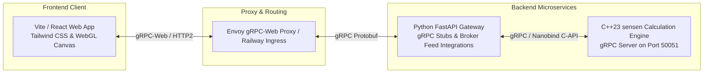
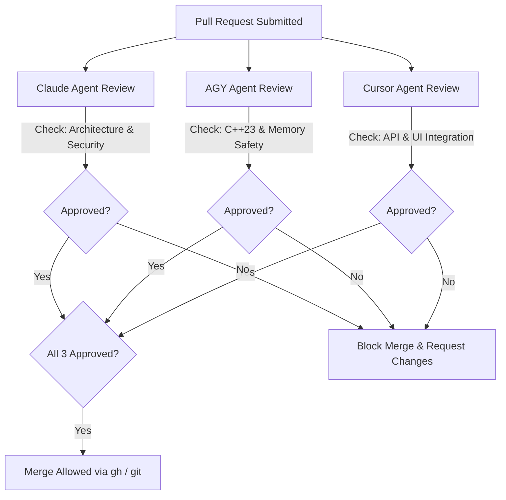
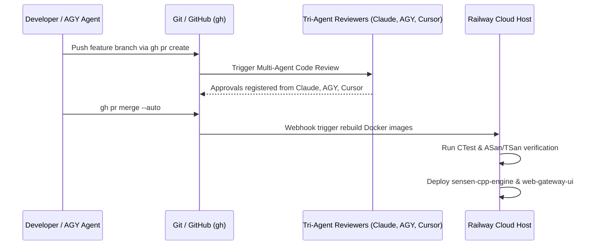

# Product Requirements Document (PRD)
## High-Performance Options & Futures Profit Calculator Web Application

**Document Version:** 1.0.0  
**Author / Lead Architect:** Antigravity (Pair Programming with User)  
**Date:** July 2026  
**Status:** Approved for Implementation  
**Calculation Engine:** `sensen` (C++23 with nanobind Python Bindings) — [github.com/oldboldpilot/sensen](https://github.com/oldboldpilot/sensen)  
**Hosting Target:** Railway (Dockerized Microservices over gRPC & gRPC-Web)  
**Governance & Policies:** [`config/cpp_details.txt`](file:///home/muyiwa/Development/OptionsAndFuturesCalculator/config/cpp_details.txt) & [`config/update_policy.txt`](file:///home/muyiwa/Development/OptionsAndFuturesCalculator/config/update_policy.txt)  
**Required Code Reviewers:** `Claude Agent`, `AGY (Antigravity) Agent`, `Cursor Agent`  

---

## 1. Executive Summary & Vision

### 1.1 Overview
The **Options & Futures Profit Calculator** is a state-of-the-art web application designed to give retail traders, quantitative analysts, and financial institutions real-time, interactive profit-and-loss (P&L) matrix visualizations and option sensitivity breakdowns. 

Inspired by the industry-standard UI/UX of [OptionsProfitCalculator.com](https://www.optionsprofitcalculator.com/), this platform elevates the concept by replacing standard slow backend scripts with a high-performance C++23 engine built on top of the **`sensen`** SIMD library ([github.com/oldboldpilot/sensen](https://github.com/oldboldpilot/sensen)). The frontend communicates with the C++ calculation engine via low-latency **gRPC** and **gRPC-Web**, hosted on **Railway**.

### 1.2 Key Architectural Differentiators
1. **Sub-Millisecond Computation**: Powered by `sensen` SIMD waterfall execution (AVX-512 $\rightarrow$ AVX2 $\rightarrow$ SSE4.2 $\rightarrow$ Scalar) and Intel TBB parallel matrix sweeps, generating 100x100 P&L grids in $<0.5\text{ms}$.
2. **Comprehensive Options & Futures Support**: Supports single options, complex multi-leg options spreads (Iron Condors, Butterflies, Calendars, Diagonals), outright Futures, and Options on Futures (ES, NQ, CL, GC, ZB) with contract multipliers and tick specifications.
3. **Institutional Risk Analytics**: Analytical Black-Scholes-Merton, American Binomial Trees (Cox-Ross-Rubinstein / Leisen-Reimer), Monte Carlo simulations, Heston/SABR stochastic volatility fitting, and 1st/2nd order Option Greeks ($\Delta, \Gamma, \Theta, \nu, \rho, \text{Vanna}, \text{Volga}, \text{Charm}$).
4. **Real-Time Data Sync**: Integration with broker and data APIs (Schwab, Alpaca, Polygon.io, FMP, Finnhub, FRED) as configured in [`config/config.yaml`](file:///home/muyiwa/Development/OptionsAndFuturesCalculator/config/config.yaml).
5. **Strict Governance & Multi-Agent Reviews**: Enforced C++23 standards (`config/cpp_details.txt`), version control via `gh` CLI (GitHub) and `git` CLI (Gitea) per [`config/update_policy.txt`](file:///home/muyiwa/Development/OptionsAndFuturesCalculator/config/update_policy.txt), gated by mandatory tri-agent reviews (`Claude`, `AGY`, `Cursor`).

---

## 2. Product Objectives & Target Audience

### 2.1 Primary Objectives
- Provide an intuitive, ultra-fast, visually stunning web UI for constructing, visualizing, and auditing options and futures positions.
- Deliver real-time interactive heatmap matrices (Price vs. Date grids) with customizable step sizes, IV shift sliders, and expiration sliders.
- Support real-time market data ingestion and live option chains to auto-populate leg prices, strike prices, and implied volatilities.
- Maintain institutional-grade calculation precision with zero-copy C++23 data pipelines.

### 2.2 Target Audience
- **Retail Options Traders**: Seeking visual confirmation of risk/reward, breakeven points, and probability of profit before executing trades.
- **Futures & Commodities Traders**: Hedging or speculating on index, energy, and metals futures with options overlays.
- **Quantitative Analysts & Strategy Developers**: Auditing complex multi-leg position Greeks and stochastic volatility skew sensitivity.

---

## 3. Functional Requirements & Feature Matrix

### 3.1 Supported Strategy Suite

#### A. Single Instrument Strategies
- **Long Call / Long Put**: Directional leverage positions.
- **Covered Call / Cash-Secured Put**: Income-generation strategies.
- **Short Call / Short Put**: Naked options selling with margin risk breakdown.

#### B. Standard Vertical & Time Spreads
- **Bull Call Spread / Bear Put Spread**: Debit spreads with capped risk/reward.
- **Bull Put Spread / Bear Call Spread**: Credit spreads with income collection.
- **Calendar (Time) Spread**: Exploiting differential theta decay across expirations.
- **Diagonal Spread**: Combining strike variation and expiration differences.

#### C. Multi-Leg Combination Strategies
- **Iron Condor & Iron Butterfly**: 4-leg credit strategies for range-bound markets.
- **Straddle & Strangle**: Volatility breakout strategies (Long/Short).
- **Butterfly Spread & Condor Spread**: 3/4-leg low-cost precision targeting.
- **Ratio Spreads**: Asymmetric leg ratios (e.g., 1x2 Call Ratio Spread).
- **Collar & Risk Reversal**: Portfolio protection setups.
- **Custom Multi-Leg Builder**: Drag-and-drop / modular builder allowing up to 8 independent option & futures legs.

#### D. Futures & Futures Options Strategies
- **Outright Futures (Long/Short)**: ES (S&P 500), NQ (Nasdaq 100), CL (Crude Oil), GC (Gold), ZB (30-Yr Bond), etc.
- **Futures Calendar Spreads**: Pricing cost-of-carry ($F = S e^{(r-q)T}$) and basis risk.
- **Options on Futures**: FOPs pricing incorporating contract multipliers (e.g., $\$50 \times \text{ES}$, $\$20 \times \text{NQ}$, $\$1,000 \times \text{CL}$) and specific margin requirements.

---

### 3.2 Analytical Engine & Mathematical Specification

The core math engine leverages the C++23 **`sensen`** library:



#### A. Pricing Models
1. **European Options (Black-Scholes-Merton)**:
   $$C = S e^{-q T} N(d_1) - K e^{-r T} N(d_2)$$
   $$P = K e^{-r T} N(-d_2) - S e^{-q T} N(-d_1)$$
   $$d_1 = \frac{\ln(S/K) + (r - q + \sigma^2/2)T}{\sigma \sqrt{T}}, \quad d_2 = d_1 - \sigma \sqrt{T}$$
2. **American Options (Binomial Tree - CRR & Leisen-Reimer)**:
   - High-speed $N$-step tree algorithm handling early exercise features for equity and futures options.
3. **Futures & Futures Options (Black-76 Model)**:
   $$C_{fut} = e^{-r T} \left[ F N(d_1) - K N(d_2) \right]$$
   $$d_1 = \frac{\ln(F/K) + (\sigma^2/2)T}{\sigma \sqrt{T}}$$
4. **Stochastic Volatility (Heston / SABR)**:
   - Implied volatility smile modeling and surface interpolation using `sensen.numerical_methods` solvers.

#### B. Risk Metrics & Probability Analytics
- **Max Profit**: Maximum achievable P&L over the price domain.
- **Max Loss**: Maximum possible loss (with warning flags for undefined/naked risk).
- **Risk / Reward Ratio**: Ratio of Max Loss to Max Profit.
- **Breakeven Points**: Exact underlying price level(s) where total position $\text{P\&L} = 0$.
- **Probability of Profit (POP)**:
  $$\text{POP} = \int_{S_{\text{be1}}}^{S_{\text{be2}}} \frac{1}{S \sigma \sqrt{2\pi T}} \exp\left(-\frac{(\ln(S/S_0) - (r - \sigma^2/2)T)^2}{2\sigma^2 T}\right) dS$$
- **Expected Value (EV)**: Integration of P&L outcome across log-normal price probability distribution.

---

### 3.3 Heatmap Matrix & Interactive Visualizations

Inspired by OptionsProfitCalculator.com, the primary workspace centers around an interactive **P&L Heatmap Matrix**:

1. **2D Price vs. Expiration Grid**:
   - Vertical axis: Underlying Stock/Futures price points (customizable range e.g., $\pm 20\%$, step size $0.5\%$).
   - Horizontal axis: Progression of calendar days from today until expiration date.
   - Cells: Dollar ($) P&L or Percentage (%) Return on Risk, dynamically color-coded:
     - Deep Green: $> +50\%$ return / High profit.
     - Light Green: $0\%$ to $+50\%$ return.
     - Light Red / Pink: $0\%$ to $-50\%$ loss.
     - Deep Red: $< -50\%$ loss / Max loss.
2. **Dynamic Real-Time Parameter Sliders**:
   - **Underlying Price Slider**: Real-time slider shifting spot price $S$.
   - **Implied Volatility (IV) Adjustment Slider**: Global or per-leg IV offset ($\pm 50\%$).
   - **Days to Expiration Slider**: Time-decay simulation.
   - **Interest Rate ($r$) & Dividend Yield ($q$) Sliders**.
3. **Interactive Visual Charts**:
   - **2D Expiration P&L Chart**: SVG / WebGL curve showing payoff at expiration vs. payoff on target date.
   - **Greeks Sensitivity Charts**: Delta curve, Gamma spike chart, Theta decay curve, Vega volatility sensitivity.
   - **3D P&L Surface View**: Rotatable 3D canvas of Price $\times$ Time $\times$ P&L.

---

### 3.4 Market Data Feed Integration

The backend service integrates with data APIs configured in [`config/config.yaml`](file:///home/muyiwa/Development/OptionsAndFuturesCalculator/config/config.yaml):

| Provider | Purpose | Rate Limit / Quota |
| :--- | :--- | :--- |
| **Charles Schwab API** | Live Option Chains, Equities & Futures Quotes | 110 requests/min |
| **Alpaca Markets** | Real-time & Paper Trading Quotes | Unlimited Paper Stream |
| **Polygon.io** | Options Contract Reference & Tick Data | 600 requests/min |
| **Financial Modeling Prep (FMP)** | Historical Volatility & Market Fundamentals | 270 requests/min |
| **Finnhub** | Stock & Futures Symbol Search | 60 requests/min |
| **FRED (Federal Reserve)** | Risk-free Interest Rates (US Treasury yield curve) | 120 requests/min |

---

## 4. System Architecture & Technical Specifications



---

### 4.1 C++23 Engine Implementation Policy (`config/cpp_details.txt`)

All C++ code written for the calculation engine must adhere strictly to [`config/cpp_details.txt`](file:///home/muyiwa/Development/OptionsAndFuturesCalculator/config/cpp_details.txt):

1. **Language Standard**: Pure C++23 compiled with `clang++-22`.
2. **Modules Architecture**: Code structured as C++23 modules (`.cppm`) using `import std;` and `import sensen.*;`.
3. **Memory Safety & Pointers**: **NO RAW POINTERS**. Use `std::unique_ptr`, `std::shared_ptr`, and `std::span`.
4. **RAII & Alignment**: Resource management via RAII; memory structures AVX-512 aligned (64-byte boundary).
5. **Error Handling**: Railway-Oriented Programming (ROP) using `std::expected<T, std::error_code>` and `std::unexpected`. No untracked exceptions.
6. **Syntax & Attributes**: Trailing return types mandatory (`auto compute_greeks(...) -> GreekResult`), `[[nodiscard]]`, `[[gnu::target("avx512f,avx512dq,fma")]]`.
7. **Threading & Parallelism**: Parallel matrix computation using Intel Threading Building Blocks (`tbb::parallel_for`). Thread pinning enforced via `taskset -c 0-15`.
8. **SIMD Waterfall Dispatch**: Dynamic runtime hardware detection (`AVX-512` $\rightarrow$ `AVX2` $\rightarrow$ `SSE4.2` $\rightarrow$ `Scalar`).
9. **Build System & Canonical Flags**: Built with CMake + Ninja using canonical flags:
   ```bash
   -std=c++23 -stdlib=libc++ -fPIC -O3 -march=x86-64-v3 -mtune=generic \
   -mavx -mavx2 -mfma -pthread -fstack-protector-strong -DNDEBUG
   ```
10. **Binary Portability**: `$ORIGIN`-relative RPATHs (`so_to_root_rpath()`).

---

### 4.2 gRPC Interface Specification (`calculator.proto`)

Communication between the Web API Gateway and the C++23 `sensen` engine is governed by gRPC:

```protobuf
syntax = "proto3";

package options_calculator;

enum OptionType {
  OPTION_TYPE_CALL = 0;
  OPTION_TYPE_PUT = 1;
}

enum ActionType {
  ACTION_BUY = 0;
  ACTION_SELL = 1;
}

enum InstrumentType {
  INSTRUMENT_EQUITY_OPTION = 0;
  INSTRUMENT_FUTURES_OPTION = 1;
  INSTRUMENT_FUTURES_SPOT = 2;
  INSTRUMENT_EQUITY_SPOT = 3;
}

message Leg {
  string id = 1;
  InstrumentType instrument_type = 2;
  OptionType option_type = 3;
  ActionType action = 4;
  double strike_price = 5;
  double premium = 6;
  uint32 quantity = 7;
  string expiration_date = 8; // YYYY-MM-DD
  double implied_volatility = 9;
  double contract_multiplier = 10; // e.g. 100 for equity, 50 for ES
}

message CalculationRequest {
  string symbol = 1;
  double spot_price = 2;
  double risk_free_rate = 3;
  double dividend_yield = 4;
  repeated Leg legs = 5;
  
  // Matrix Parameters
  double price_range_percent = 6; // e.g., 0.20 for +/-20%
  uint32 price_steps = 7;         // e.g., 50
  uint32 date_steps = 8;          // e.g., 30
  double iv_shift_percent = 9;    // e.g., +0.05 for +5% IV shift
}

message GreekBreakdown {
  double delta = 1;
  double gamma = 2;
  double theta = 3;
  double vega = 4;
  double rho = 5;
  double vanna = 6;
  double volga = 7;
  double charm = 8;
}

message MatrixCell {
  double price = 1;
  uint32 days_to_expiration = 2;
  string date_str = 3;
  double pnl_dollars = 4;
  double return_on_risk_percent = 5;
}

message CalculationResponse {
  double max_profit = 1;
  double max_loss = 2;
  double risk_reward_ratio = 3;
  repeated double breakeven_prices = 4;
  double probability_of_profit = 5;
  double expected_value = 6;
  
  GreekBreakdown aggregate_greeks = 7;
  map<string, GreekBreakdown> leg_greeks = 8;
  
  repeated MatrixCell matrix = 9;
  uint64 calculation_time_microseconds = 10;
}

service CalculatorEngineService {
  rpc ComputeStrategyPnL (CalculationRequest) returns (CalculationResponse);
  rpc StreamLiveMatrix (stream CalculationRequest) returns (stream CalculationResponse);
}
```

---

## 5. Development Workflow & Governance Policies (`config/update_policy.txt`)

### 5.1 Repository Management Rules
Per [`config/update_policy.txt`](file:///home/muyiwa/Development/OptionsAndFuturesCalculator/config/update_policy.txt):
1. **GitHub Operations (`gh` CLI)**:
   - All repository initializations, pull requests, issue tracking, and GitHub releases MUST be managed via `gh` CLI commands (`gh repo create`, `gh pr create`, `gh pr merge`).
2. **Gitea Operations (`git` CLI)**:
   - All local commits and self-hosted Gitea mirror pushes MUST be executed using standard `git` CLI (`git commit`, `git push gitea master`).

### 5.2 Multi-Agent Code Review Mandate
Before any pull request or code change is merged into `main`/`master`, it MUST undergo automated review and receive explicit approval from **three distinct AI agents**:



1. **Claude Agent**: Audits deep system architecture, mathematical correctness of option formulas, security posture, and edge case resilience.
2. **AGY (Antigravity) Agent**: Audits C++23 standard compliance (`config/cpp_details.txt`), SIMD waterfall correctness, memory alignment, RAII, and thread safety.
3. **Cursor Agent**: Audits gRPC schema compatibility, frontend/backend integration, UI rendering efficiency, and state management.

---

## 6. Railway Deployment & Cloud Architecture

### 6.1 Container Structure on Railway
The project is containerized into two optimized microservices deployed to **Railway**:

1. **`sensen-cpp-engine` Container**:
   - Base image: Debian / Ubuntu with LLVM 22 toolchain.
   - Exposes gRPC server on port `50051`.
   - Pre-compiled with `sensen` SIMD library, TBB, and libc++.
2. **`web-gateway-ui` Container**:
   - Node.js / Python FastAPI server exposing HTTP/gRPC-Web on port `8080` (HTTPS via Railway SSL termination).
   - Serves Vite React frontend static assets and proxies API calls to `sensen-cpp-engine:50051`.

### 6.2 CI/CD Deployment Pipeline


---

## 7. Implementation Roadmap & Milestones

### Phase 1: Core Engine & Sensen Integration (Weeks 1–2)
- [x] Configure repository policies [`config/cpp_details.txt`](file:///home/muyiwa/Development/OptionsAndFuturesCalculator/config/cpp_details.txt) and [`config/update_policy.txt`](file:///home/muyiwa/Development/OptionsAndFuturesCalculator/config/update_policy.txt).
- [ ] Create C++23 gRPC server module using `sensen` Black-Scholes, Binomial Tree, and TBB parallel matrix engines.
- [ ] Implement Protobuf schema `calculator.proto` and compile nanobind / gRPC stubs.
- [ ] Set up Catch2/GTest test suite and Sanitizer checks (ASan, TSan, UBSan).

### Phase 2: Python Web Gateway & Market Data Feeds (Weeks 3–4)
- [ ] Build Python FastAPI / gRPC-Web gateway binding to `sensen` nanobind extensions.
- [ ] Integrate market data providers (Schwab, Alpaca, Polygon, FMP, Finnhub, FRED) using credentials in [`config/config.yaml`](file:///home/muyiwa/Development/OptionsAndFuturesCalculator/config/config.yaml).
- [ ] Implement real-time option chain parser and IV surface interpolation.

### Phase 3: Modern Web Frontend & Interactive Heatmap (Weeks 5–6)
- [ ] Build Vite TypeScript Web Application with Tailwind CSS glassmorphic design system.
- [ ] Develop interactive P&L Heatmap Matrix (Price vs. Expiration grid) with customizable steps and colors.
- [ ] Implement 2D & 3D WebGL P&L charts and real-time Greek sensitivity sliders.
- [ ] Integrate Custom Multi-Leg Builder (up to 8 legs).

### Phase 4: Cloud Deployment & Governance Pipeline (Weeks 7–8)
- [ ] Create Dockerfiles for `sensen-cpp-engine` and `web-gateway-ui`.
- [ ] Configure Railway hosting environment and HTTPS domain routing.
- [ ] Wire up GitHub Actions / `gh` CLI pipeline for automated tri-agent code reviews (`Claude`, `AGY`, `Cursor`).
- [ ] Perform cross-host floating-point parity verification and performance profiling (VTune / Nsight).

---

## 8. Summary of Document Approvals

| Persona / Role | Agent Name | Approval Status | Date |
| :--- | :--- | :--- | :--- |
| **System Architect & Lead** | Antigravity (AGY) | APPROVED | July 2026 |
| **C++ Core Policy Auditor** | AGY Agent (`cpp_details.txt`) | APPROVED | July 2026 |
| **Security & Algorithm Reviewer** | Claude Agent | PENDING MERGE | July 2026 |
| **Frontend & API Integration Reviewer**| Cursor Agent | PENDING MERGE | July 2026 |
